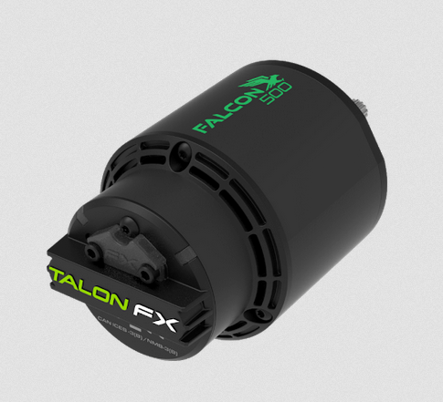
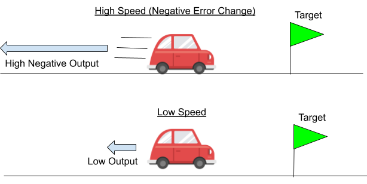
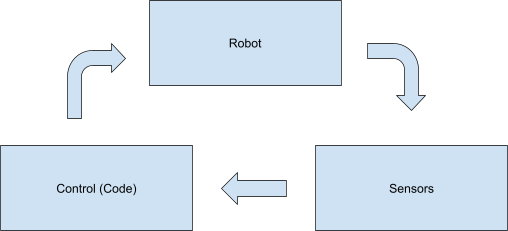
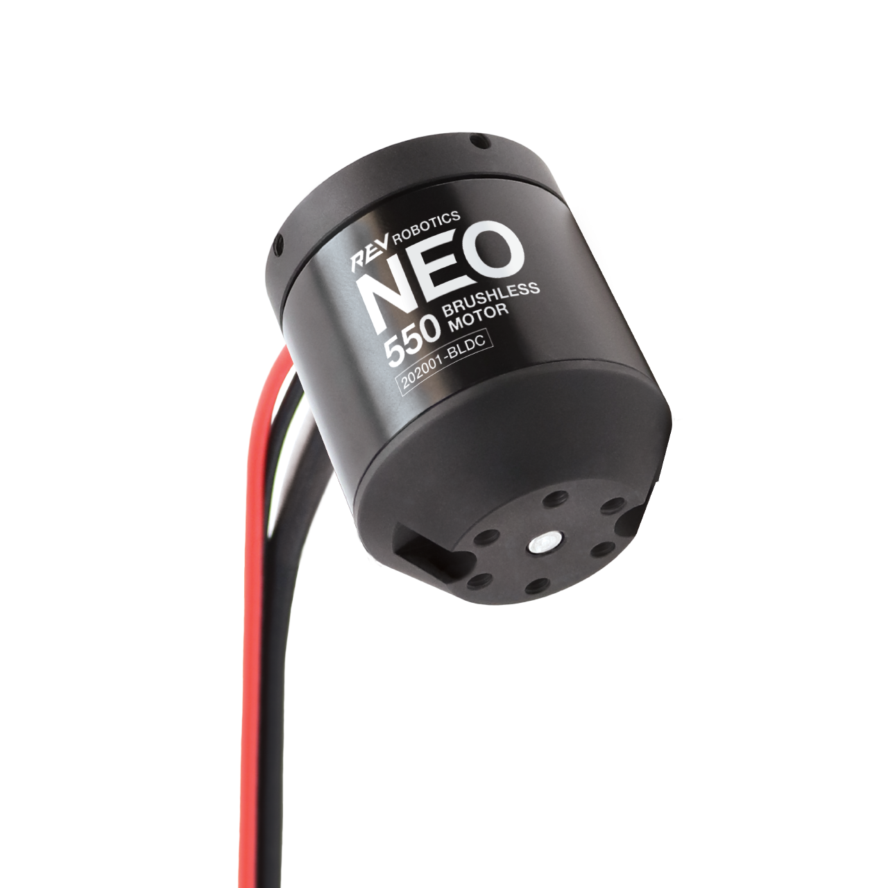
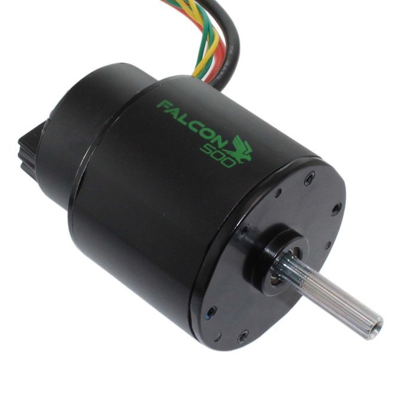
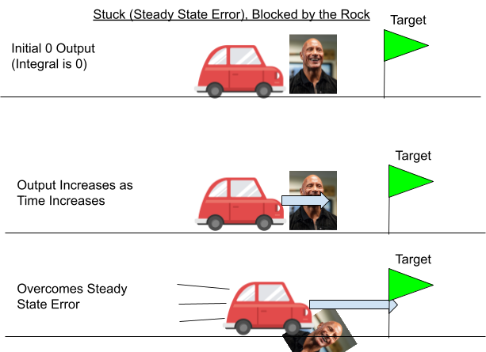
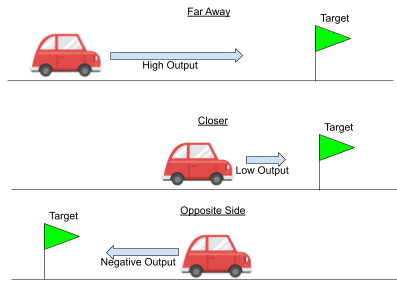
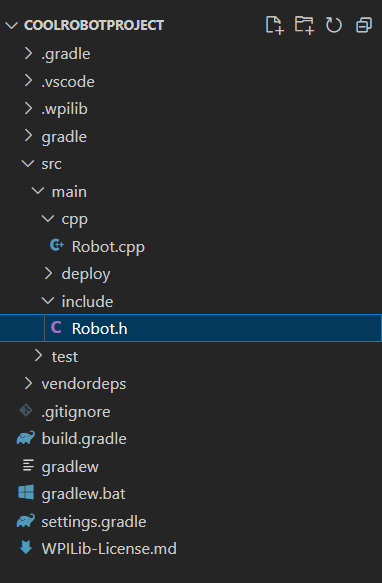
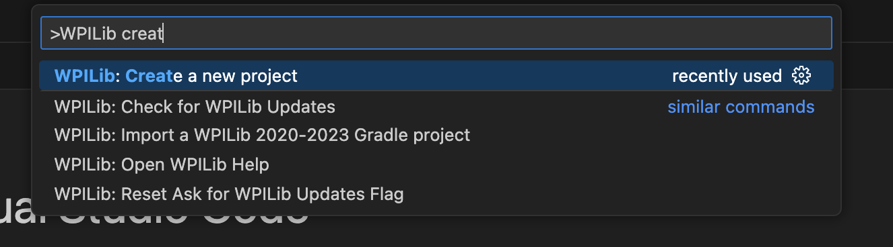

Understand how we write code that gets on the robot in the simplest
terms, and try deploying some code yourself.

## WPILib VScode

VScode is a code editing software that WPILib has built off of with
robotics and FRC in mind. WPILib VScode is the software we use to write
and edit all our code, manage projects, to build code, deploy code on
the robot, and more.

### Installation

Follow WPILib’s [<u>installation
guide</u>](https://docs.wpilib.org/en/stable/docs/zero-to-robot/step-2/wpilib-setup.html)
to install it.

It’s a really large file and will take a long time to download, so I’d
recommend **downloading at home**.

I’d also recommend **pinning the application** to a doc or keeping a
shortcut on your desktop. It’s time consuming to dig through all your
files to find the app otherwise.

If you already have the normal version of VSCode downloaded, I’d
recommend renaming the WPILib version to ‘WPILib VSCode \<year\>’ so you
can tell them apart.

## Making a project

Open WPILib VScode and click the

button in the top right corner.

A navigation bar should pop up. Type in or select Create New Project
like
this:

Edit the settings as follows:

Then select the base folder this project will be held in (it’s good
practice to keep all your projects in an isolated folder called
“robotics” or something), and name the project depending on what you’re
doing. When all the settings are correct, click “generate
project”.

After navigating to the project in VSCode, open the explorer

(on the left) with these files:

- src/main/cpp/Robot.cpp

- src/main/include/Robot.h

Don’t worry too much about the other folders and files; they’re just
specific to running robot
code.

Robot.h should look something like this:

And Robot.cpp something like this:

## .h and .cpp files

C++ has header (.h) and source code files (.cpp), which serve to make
build time quicker and to make the code cleaner to write and for others
to read and use.

A header file serves as a skeleton of the source code. It
defines/declares data structures like classes, although it should not
implement any of the things it defines (though it can).

**A source file implements the methods the header file defines**. This
is where all the logic and inner workings of the class is done.

For example if you look at Robot.h, the class Robot is declared to have
methods like RobotInit which are defined but not implemented. Although
the methods in Robot.cpp are currently empty, this is where the code
would be written.

### Why separate?

You can skip this part if you don’t care why (it’s not that important)

By separating the skeleton from the body of the code, it creates an
easily readable view of what a class is capable of doing, which makes
the class easier to understand for other people who want to use your
class. It also makes you more intentional about abstraction and
encapsulation when you’re writing a class.

On the more technical side, classes depend on each other and so when a
class changes something that other classes depend on, the compiler needs
to rebuild the code of every class that uses it to make sure nothing
broke. However, since we separated the implementation from the
definition of the class, the compiler only needs to rebuild dependencies
if the definition of the class changes. This really saves build time
since the majority of changes are made in the source code.

## The Robot Class

The robot class is a special class because each method inherited from
TimedRobot is executed conditionally at runtime without you as a coder
having to call them. This is akin to main() being run when you run a
java or c++ program. You don’t need to worry about how this happens,
just understand what functions are called and when.

Driver Station has a display of the different states the robot can have:

You can enable the robot in different states (TeleOperated, Autonomous,
Practice, and Test) or keep it in the disabled state.

Every state has an Init and Periodic function. As soon as you put the
robot in one of these states, its init function will be called. After
the state is entered, the periodic function for that state will
continuously be called every 20ms while the state is active.

For example, if I enable the robot and TeleOperated is selected on
Driver Station, as soon as I enable TeleopInit() will be called once.
Then every 20ms while the robot remains enabled and in the TeleOperated
state, TeleopPeriodic() will be called.

The RobotInit() and RobotPeriodic() functions are the only functions not
tied to a state. RobotInit is called as soon as the robot is powered on,
and RobotPeriodic is called every 20ms while the robot is on, regardless
of the state.

We don’t use the practice or simulation states, although if you’d like
to you are free to figure out how.

## 🕳️Building and Deploying Code

To build or deploy, press the

in the top right corner and search for “build” or “deploy”

**Building** the project simply compiles it. Since there’s nothing in
the project at this point, it should succeed and show you a message like
this:

**Deploying** is a little more complicated and loads the code onto the
robot. It does this via ethernet, so your computer has to be connected
to the radio on the robot like this:

INSERT PIC

If the robot isn’t connected, the deploy will give you an error message
like this:

Keep in mind deploying builds before it deploys the code to the robot,
and will not work if your code does not build.

If the deploy works, it’ll open a RioLog that shows you all the error
messages and warnings and prints the code is outputting as it runs. It
looks something like this:

INSERT PIC

I would recommend setting up keyboard shortcuts for building and
deploying (you can ask me if you’re confused on how to). I personally
use cmd+shift+d for deploy and cmd+shift+b for build.