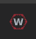

# Creating a project

Open WPILib VScode and click the 

A navigation bar should pop up. Type in or select Create New Project
like this:
```{image} media/image2.png
:width: 6.5in
:height: 1.8in
```


Edit the settings as follows:

```{image} media/image20.png
:width: 6.5in
:height: 2.22917in
```

Then select the base folder this project will be held in (it’s good
practice to keep all your projects in an isolated folder called
“robotics” or something), and name the project depending on what you’re
doing. When all the settings are correct, click “generate project”.


```{image} media/image6.png 
:width: 1.81871in
:height: 2.77721in
:align: right
```
After navigating to the project in VSCode, open the explorer with these files:

- src/main/cpp/Robot.cpp

- src/main/include/Robot.h


Don’t worry too much about the other folders and files; they’re just
specific to running robot code.

<br>
<br><br><br>


```{image} media/image12.png 
:width: 2.33333in
:height: 2.103in
:align: right
```
<br><br><br>

Robot.h should look something like this:

<br>
<br>

<br>
<br><br><br>

```{image} media/image19.png 
:width: 2.33333in
:height: 1.73247in
:align: right
```
<br><br><br>

And Robot.cpp something like this:
