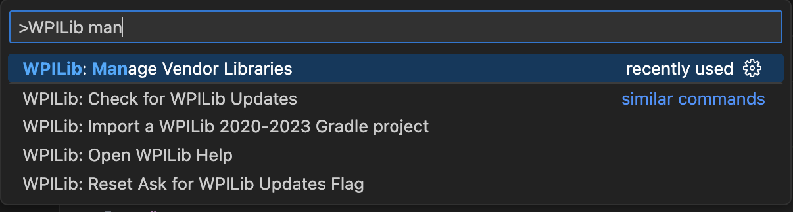
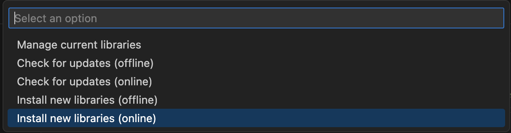
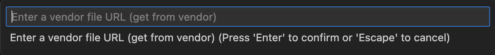
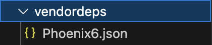

# Installing vendor libraries

To install a vendor library, click the  in the top right corner.

Then search for and click on "Manage vendor libraries"

Then from there select "install new libraries (online)"

After that it will prompt you to give it the vendor url.

[Here](https://docs.wpilib.org/en/stable/docs/software/vscode-overview/3rd-party-libraries.html#vendor-libraries) is a list of the vendor URLS for every vendor that WPILib supports. Copy the url and paste it into the prompt

You can check if the library successfully installed if the vendordeps folder has a .json file for the library like this: 
